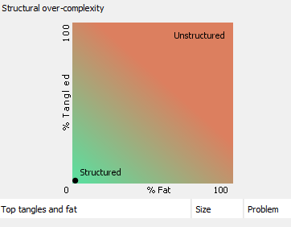

[](https://travis-ci.org/shapley-value-java/shapley-value-core) [](https://maven-badges.herokuapp.com/maven-central/io.github.shapley-value-java/shapley-value-core) 

Thanks to [](https://structure101.com/)

# Shapley value introduction
this project is about Shapley value calculation in Java (and Kotlin) introduced by Lloyd Shapley. To have a complete view you can have a look to the wikipedia article https://en.wikipedia.org/wiki/Shapley_value.

In a cooperative game, some players have the possibility to forge coalitions to reach a common goal : increase a revenue, or share a cost.

A difficulty in cooperation game theory is the fair distribution of profits among the players. The Shapley value provides on possible answer to this question.


# The Great Debate
First a little joke : 
- The great question for the father of Lloyd Shapley, Harlow Shapley was the size of the universe (see https://en.wikipedia.org/wiki/Great_Debate_(astronomy))
- The great question for Lloyd Shapley was how to share a taxi ...

Only the son received the Nobel price (in economics, in 2012)

# Shapley value introduction
## Formula and notations
The formula are done with the web site https://www.codecogs.com/latex/eqneditor.php 

- N is the set containing all the players
- S is a subset of N
- Characteristic function is writen down 'v()'
- The Shapley value is the Greek letter phi (<a href="https://www.codecogs.com/eqnedit.php?latex=\phi" target="_blank"></a>)

To be more complete the Shapley value for the player i is writen like that

<a href="https://www.codecogs.com/eqnedit.php?latex=\phi_{i}(N,v)" target="_blank"></a>

But often I simply write
<a href="https://www.codecogs.com/eqnedit.php?latex=\phi(i)" target="_blank"></a>

## Characteristic function v
In a cooperative game 
* with n players N={1,2,..., n}
* a coalition is a subset of N

The characteristic function associates for each coalition a real number. 
With this function, we can know the revenue (or the cost) for the a coalition S : v(S). 
The value of v({}) (empty set) is 0, because if there is no player there is no cost or revenue.


## Fair distribution 
The Shapley value is based on four axioms :

* Efficiency

The sum of the Shapley values of all participants are equals to the value generated by the grand coalition.

<a href="https://www.codecogs.com/eqnedit.php?latex=\sum_{i\subset&space;N}&space;\phi_{i}(v)&space;=&space;v(N)" target="_blank"></a>
* Null player 

The Shapley value of a null player i is null. A null player is a player who never contributes.

<a href="https://www.codecogs.com/eqnedit.php?latex=i\&space;is\&space;null\&space;player\&space;if\&space;v\left&space;(&space;S&space;\cup&space;\left&space;\{&space;i&space;\right&space;\}&space;\right&space;)=&space;v\left&space;(&space;S&space;\right&space;)&space;for\&space;all\&space;S\&space;subset\&space;of\&space;N" target="_blank"></a>

<a href="https://www.codecogs.com/eqnedit.php?latex=\phi&space;_{i}(v)=0" target="_blank"></a>

* Symmetry

if i and j are two equivalent actors, they will have the same Shapley value.

<a href="https://www.codecogs.com/eqnedit.php?latex=v(S\cup&space;\left&space;\{&space;i&space;\right&space;\})=&space;v(S\cup&space;\left&space;\{&space;j&space;\right&space;\})\&space;for\&space;all\&space;subset\&space;of\&space;N\&space;then\&space;\phi_{i}(v)&space;=&space;\phi_{j}(v)" target="_blank"></a>

* Additivity

If you bring more, you get more

To respect these 4 axioms there is only one solution, one way to calculate the Shapley value. The calculation is the average of the marginal contribution.

## Application example share a taxi 
How to share a taxi travel ?
Amy, Bob and Clare are sharing a taxi. We imagine they are going to the same direction.

- Amy must pay 6 to go home
- Bob must pay 12 to go home
- Clare must pay 42 to go home

If they share the taxi, the Shapley value will give :
- Amy must pay 2
- Bob must pay 5
- Clare must pay 35
- The total 2+5+35 = 42

With this example, we can see that Shapley value is for everybody efficient. Because Amy, Bob, and Clare pay less when they share than when they travel alone but the sum of the three values are enough to pay the bill.


# Calculation examples

Here is several examples with a few participants. You can imagine that with big groups the calculation becomes very difficult.

## One element
### Input 
characteristic function : 

<a href="https://www.codecogs.com/eqnedit.php?latex=N&space;=&space;\left&space;\{&space;1&space;\right&space;\}" target="_blank"></a>

<a href="https://www.codecogs.com/eqnedit.php?latex=2^{N}&space;\rightarrow&space;\mathbb{R}" target="_blank"></a>

- <a href="https://www.codecogs.com/eqnedit.php?latex=v\left&space;(&space;\varnothing&space;\right&space;)&space;=&space;0.0" target="_blank"></a>

- <a href="https://www.codecogs.com/eqnedit.php?latex=v\left&space;(&space;\left&space;\{&space;1&space;\right&space;\}&space;\right&space;)&space;=&space;1.0" target="_blank"></a>


### Output
shapley value 

<a href="https://www.codecogs.com/eqnedit.php?latex=N\rightarrow&space;\mathbb{R}" target="_blank"></a>

<a href="https://www.codecogs.com/eqnedit.php?latex=\Phi&space;\left&space;(&space;1&space;\right&space;)=1.0" target="_blank"></a>

### Code example

```java
	@Test
	public void testCalculateOneParticipant() {
		
		CharacteristicFunction cfunction = 
				new CharacteristicFunction.CharacteristicFunctionBuilder(1)
				.addCoalition(1.0, 1).build();
	
		ShapleyValue s = new ShapleyValue(cfunction);
		s.calculate();
		Map<Integer,Double> output =s.getResult();
		
		double phi1 = output.get(1);	
		assertEquals(phi1, 1.0, 0.01);
	}
```

## Two elements
### Input
<a href="https://www.codecogs.com/eqnedit.php?latex=N&space;=&space;\left&space;\{&space;1,2&space;\right&space;\}" target="_blank"></a>

Characteristic function : <a href="https://www.codecogs.com/eqnedit.php?latex=2^{N}&space;\rightarrow&space;R" target="_blank"></a>
- <a href="https://www.codecogs.com/eqnedit.php?latex=v\left&space;(&space;\varnothing&space;\right&space;)&space;=&space;0.0" target="_blank"></a>
- <a href="https://www.codecogs.com/eqnedit.php?latex=v&space;\left&space;(&space;\left&space;\{&space;1&space;\right&space;\}&space;\right&space;)&space;=&space;1" target="_blank"></a>
- <a href="https://www.codecogs.com/eqnedit.php?latex=v&space;\left&space;(&space;\left&space;\{&space;2&space;\right&space;\}&space;\right&space;)&space;=&space;2" target="_blank"></a>
- <a href="https://www.codecogs.com/eqnedit.php?latex=v&space;\left&space;(&space;\left&space;\{&space;1,2&space;\right&space;\}&space;\right&space;)&space;=&space;4" target="_blank"></a>

### Calculation

| Order | marginal contribution 1  | marginal contribution 2 |
| ----- | ------------------------ | ----------------------- |
| 1 2   | v({1})=1                 | v({1,2})-v({1}) =3      |
| 2 1   | v({1,2})-v({2})=2        | v({2})= 2               |

### Output
- <a href="https://www.codecogs.com/eqnedit.php?latex=\phi&space;\left&space;(&space;1&space;\right&space;)=&space;\frac{1&plus;2}{2}&space;=1.5" target="_blank"></a>
- <a href="https://www.codecogs.com/eqnedit.php?latex=\phi&space;\left&space;(&space;2&space;\right&space;)=&space;\frac{3&plus;2}{2}&space;=2.5" target="_blank"></a>

### Remarks on the results
<a href="https://www.codecogs.com/eqnedit.php?latex=\phi&space;\left&space;(&space;1&space;\right&space;)\geq&space;v\left&space;(&space;\left&space;\{&space;1&space;\right&space;\}&space;\right&space;)" target="_blank"></a>

<a href="https://www.codecogs.com/eqnedit.php?latex=\phi&space;\left&space;(&space;2&space;\right&space;)\geq&space;v\left&space;(&space;\left&space;\{&space;2&space;\right&space;\}&space;\right&space;)" target="_blank"></a>

<a href="https://www.codecogs.com/eqnedit.php?latex=\phi&space;\left&space;(&space;1&space;\right&space;)&plus;&space;\phi&space;\left&space;(&space;2&space;\right&space;)&space;=&space;v\left&space;(&space;\left&space;\{&space;1,2&space;\right&space;\}&space;\right&space;)" target="_blank"></a>

### Code example

```java
	@Test
	public void testCalculateTwoParticipants() {
		CharacteristicFunction cfunction = 
				new CharacteristicFunction.CharacteristicFunctionBuilder(2)
				.addCoalition(1.0, 1)		
				.addCoalition(2.0, 2)
				.addCoalition(4.0, 1, 2).build();	
			
		ShapleyValue s = new ShapleyValue(cfunction);		
		s.calculate();
		Map<Integer,Double> output =s.getResult();
		
		double phi1 = output.get(1);
		double phi2 = output.get(2);
		
		assertEquals(phi1, 1.5, 0.01);
		assertEquals(phi2, 2.5, 0.01);
		
	}
```

## Three elements
### Input
<a href="https://www.codecogs.com/eqnedit.php?latex=N&space;=&space;\left&space;\{&space;1,2,3&space;\right&space;\}" target="_blank"></a> characteristic function : <a href="https://www.codecogs.com/eqnedit.php?latex=2^{N}&space;\rightarrow&space;\mathbb{R}" target="_blank"></a>
- v({1})     = 80
- v({2})     = 56
- v({3})     = 70
- v({1,2})   = 80
- v({1,3})   = 85
- v({2,3})   = 72
- v({1,2,3}) = 90

### Calculation

| Order | marginal contribution 1  | marginal contribution 2 | marginal contribution 3 |
| ----- | ------------------------ | ----------------------- | ----------------------- |
| 1 2 3 | v({1})=80                | v({1,2})-v({1}) =0      | v({1,2,3})-v({1,2}) =10 |
| 1 3 2 | v({1})=80                | v({1,2,3})-v({1,2}) =5  | v({1,3})-v({1}) =5      |
| 2 1 3 | v({1,2})-v({2})=24       | v({2}) =56              | v({1,2,3})-v({1,2}) =10 |
| 2 3 1 | v({1,2,3})-v({2,3})=18   | v({2}) =56              | v({2,3})-v({2}) =16     |
| 3 1 2 | v({1,3})-v({3})=15       | v({1,2,3}) -v({1,3}) =5 | v({3}) =70              |
| 3 2 1 | v({1,2,3})-v({2,3})=18   | v({2,3}) -v({3}) =56    | v({3}) =70              |
|   | <a href="https://www.codecogs.com/eqnedit.php?latex=\phi(1)=\frac{80&plus;80&plus;24&plus;18&plus;15&plus;18}{6}" target="_blank"></a> | <a href="https://www.codecogs.com/eqnedit.php?latex=\phi(2)=\frac{0&plus;5&plus;56&plus;56&plus;5&plus;2}{6}" target="_blank"></a> | <a href="https://www.codecogs.com/eqnedit.php?latex=\phi(3)=\frac{10&plus;5&plus;10&plus;16&plus;70&plus;70}{6}" target="_blank"></a> |
|   | <a href="https://www.codecogs.com/eqnedit.php?latex=\phi&space;\left&space;(&space;1&space;\right&space;)=\frac{235}{6}&space;=&space;39.17" target="_blank"></a> | <a href="https://www.codecogs.com/eqnedit.php?latex=\phi&space;\left&space;(&space;2&space;\right&space;)=\frac{124}{6}&space;=&space;20.67" target="_blank"></a> | <a href="https://www.codecogs.com/eqnedit.php?latex=\phi&space;\left&space;(&space;3&space;\right&space;)=\frac{181}{6}&space;=&space;30.17" target="_blank"></a> |


### Output
- <a href="https://www.codecogs.com/eqnedit.php?latex=\phi\left&space;(&space;1&space;\right&space;)=&space;39.2" target="_blank"></a>
- <a href="https://www.codecogs.com/eqnedit.php?latex=\phi\left&space;(&space;2&space;\right&space;)=&space;20.7" target="_blank"></a>
- <a href="https://www.codecogs.com/eqnedit.php?latex=\phi\left&space;(&space;3&space;\right&space;)=&space;30.2" target="_blank"></a>

remarks :
<a href="https://www.codecogs.com/eqnedit.php?latex=\phi\left&space;(&space;1&space;\right&space;)&plus;\phi\left&space;(&space;2&space;\right&space;)&plus;\phi\left&space;(&space;3&space;\right&space;)&space;=&space;v\left&space;(&space;\left&space;\{&space;1,2,3&space;\right&space;\}&space;\right&space;)" target="_blank"></a>

### Code example

```java
	@Test
	public void testCalculateThreeParticipants() {		
		CharacteristicFunction cfunction = 
				new CharacteristicFunction.CharacteristicFunctionBuilder(3)
				.addCoalition(80.0, 1)	
				.addCoalition(56.0, 2)
				.addCoalition(70.0, 3)	
				.addCoalition(80.0, 1, 2)			
				.addCoalition(85.0, 1, 3)		
				.addCoalition(72.0, 2, 3)			
				.addCoalition(90.0, 1, 2, 3).build();	
	
		ShapleyValue s = new ShapleyValue(cfunction);		
		s.calculate();
		Map<Integer,Double> output =s.getResult();
		
		double v1 = output.get(1);
		double v2 = output.get(2);
		double v3 = output.get(3);
		
		assertEquals(v1, 39.2, 0.1);
		assertEquals(v2, 20.7, 0.1);
		assertEquals(v3, 30.2, 0.1);		
	}
```

# Applications
## Glove game
In the glove game the players have a left or a right glove. The goal is to form a pair.
A coalition with at least one left glove and one right glove wins (v(S)=1) otherwise loses (v(S)=0).

We have three players R1, R2, L3 with R1 and R2 having a right glove and L3 have a left glove. 

Using the symmetrie axiom we expect that the Shapley value is the same for R1 and R2. We expect also that L3 receives more than R1 and R2 because L3 is mandatory if we want to win the game whereas R1 or R2 are not mandatory to win the game. R1 and R2 participate less than L3.


#### Characteristic function

| S          | V(S) |
| ---------- | ---- | 
| {}         | 0    |
| {R1}       | 0    |
| {R2}       | 0    |
| {L3}       | 0    |
| {R1,R2}    | 0    |
| {R1,L3}    | 1    |
| {R2,L3}    | 1    |
| {R1,R2,L3} | 1    |

### Calculation

| Order    | marginal contribution R1 | marginal contribution R2 | marginal contribution L3 |
| -------- | ------------------------ | ------------------------ | ------------------------ |
| R1 R2 L3 | 0                        | 0                        | 1                        |
| R1 L3 R2 | 0                        | 0                        | 1                        |
| R2 R1 L3 | 0                        | 0                        | 1                        |
| R2 L3 R1 | 0                        | 0                        | 1                        |
| L3 R1 R2 | 1                        | 0                        | 0                        |
| L3 R2 R1 | 0                        | 1                        | 0                        |
|          | <a href="https://www.codecogs.com/eqnedit.php?latex=\phi(R1)=\frac{1}{6}" target="_blank"></a> | <a href="https://www.codecogs.com/eqnedit.php?latex=\phi(R2)=\frac{1}{6}" target="_blank"></a> | <a href="https://www.codecogs.com/eqnedit.php?latex=\phi(L3)=\frac{4}{6}=\frac{2}{3}" target="_blank"></a> |

### Code java

```java
	@Test
	public void testEvaluationThreePlayersOne() {
		
		GloveGameApplication evaluation = 
				new GloveGameApplication.GloveGameApplicationBuilder()
				.addPlayer("Adam1", Hand.LEFT)
				.addPlayer("Adam2", Hand.LEFT)
				.addPlayer("Lea1", Hand.RIGHT)
				.build();
	
		
		Map<String,Double> output = evaluation.calculate();
		double phiAdam1= output.get("Adam1");
		double phiAdam2= output.get("Adam2");
		double phiLea1 = output.get("Lea1");
		
		assertEquals(phiAdam1, 0.16, 0.01);
		assertEquals(phiAdam2, 0.16, 0.01);
		assertEquals(phiLea1, 0.67, 0.01);
	}
```

## Share taxi
### Example
This example is :
Amy, Bob and Clare are sharing a taxi. We imagine they are going to the same direction.

- Amy must pay 6 to go home
- Bob must pay 12 to go home
- Clare must pay 42 to go home 

### Calculation
#### Characteristic function

| S       | V(S) |
| ------- | ---- | 
| {}      | 0    |
| {A}     | 6    |
| {B}     | 12   |
| {C}     | 42   |
| {A,B}   | 12   |
| {A,C}   | 42   |
| {B,C}   | 42   |
| {A,B,C} | 42   |

#### Permutation

| Order | marginal contribution A  | marginal contribution B | marginal contribution C |
| ----- | ------------------------ | ----------------------- | ----------------------- |
| A B C | 6                        | 6                       | 30                      |
| A C B | 6                        | 0                       | 36                      |
| B A C | 0                        | 12                      | 30                      |
| B C A | 0                        | 12                      | 30                      |
| C A B | 0                        | 0                       | 42                      |
| C B A | 0                        | 0                       | 42                      |

<a href="https://www.codecogs.com/eqnedit.php?latex=\phi_{A}(v)&space;=&space;\frac{6&plus;6}{6}=2" target="_blank"></a>

<a href="https://www.codecogs.com/eqnedit.php?latex=\phi_{B}(v)&space;=&space;\frac{6&plus;12&plus;12}{6}=5" target="_blank"></a>

<a href="https://www.codecogs.com/eqnedit.php?latex=\phi_{C}(v)&space;=&space;\frac{30&plus;36&plus;30&plus;30&plus;42&plus;42}{6}=35" target="_blank"></a>

### Code example

```java
	@Test
	public void testCalculateThreeParticipants() {		
		TaxiApplication taxiApplication = 
				new TaxiApplication.TaxiApplicationBuilder()
				.addUser(6.0, "A")
				.addUser(12.0, "B")
				.addUser(42.0, "C")
				.build();

		Map<String,Double> output = taxiApplication.calculate();
		double phiA = output.get("A");
		double phiB = output.get("B");
		double phiC = output.get("C");
				
		assertEquals(phiA, 2.0, 0.01);
		assertEquals(phiB, 5.0, 0.01);
		assertEquals(phiC, 35.0, 0.01);	
	}
```
## Fraud rules evaluation
### Simple evaluation
Example:
There are four fraudulent transactions T1, T2, T3, T4.
There are four rules trying to detect the fraud events.
- Rule1 detects T1, T2, T3
- Rule2 detects T1, T2, T3
- Rule3 detects T1, T2, T3
- Rule4 detects T4

The Shapley value evaluates the contribution of each rules (the sum will be normalized to 1)
The Rules4 detects 1/4 of the event (alone) so we can expect phiRule4=0.25
The rules 1, 2, 3 detect the same events and should have the same Shapley value.
phiRule1=phiRule2=phiRule2=0.25

#### Code example

```java
	@Test
	public void testEvaluationFourRules() {
		
		FraudRuleApplication evaluation = 
				new FraudRuleApplication.FraudRuleApplicationBuilder()
				.addRule("Rule1", 1,2,3)
				.addRule("Rule2", 1,2,3)
				.addRule("Rule3", 1,2,3)
				.addRule("Rule4", 4)
				.build();
		
		Map<String,Double> output = evaluation.calculate();
		double phiRule1 = output.get("Rule1");
		double phiRule2 = output.get("Rule2");
		double phiRule3 = output.get("Rule3");
		double phiRule4 = output.get("Rule4");
		
		assertEquals(phiRule1, 0.25, 0.01);
		assertEquals(phiRule2, 0.25, 0.01);
		assertEquals(phiRule3, 0.25, 0.01);
		assertEquals(phiRule4, 0.25, 0.01);
	}
```

### V2 using F1-score
In fact to measure the quality of the fraud rules we can used the metric "f1 score" based on the "recall" and the "precision". These three metrics f1-score, recall and precision are between 0 and 1.

Please see the article in Wikipedia https://en.wikipedia.org/wiki/F1_score for more information.

## Parliament
### First example
Question: The parliament of Micronesia is made up of four political parties, A, B, C, and D, which have 45, 25, 15, and 15 representatives, respectively.
If a coalition has the majority it receives 1, if a coalition has no majority it receives 0.

the solution is 
- phiA=0.5 
- phiB=1/6
- phiC=1/6
- phiD=1/6
B, C, and D have the same Shapley value, so the same influence.

### Belgium parliament
#### 54th legislature (2014–2019)
The Belgium parliament has 150 members and a lot of parties (13 parties, figures of the 18/04/2018)
- NVA 31
- PS 23
- MR 20
- CD&V 18
- openVLD 14
- PSA 13
- EcoloGroen 12
- CDH 9
- VB 3
- Defi 2
- PTB 2
- VW 2
- PP 1

In fact, it becomes very difficult to calculate the Shapley value for this 13 parties.
Because the number of permutation possible is huge : factorial(13)=  a lot around 6 milliard or 6 billion.

But it is possible to take a smaller set of permutations taken randomly.
In this case 500 000 permutations seems to be enough to have a precision of 0.1 percent and takes 30 seconds calculation with a old PC.

With a normalized results to 100, here is the result finally not so far from the proportional result
- NVA 22.9
- PS 15.4
- MR 13.5
- CD&V 12.0
- openVLD 8.8
- PSA 8.2
- EcoloGroen 7.6
- CDH 6.0
- VB 1.6
- Defi 1.1
- PTB 1.1
- VW 1.1
- PP 0.6

#### 55th legislature (2019–)
The Belgium parliament will have 150 members and a lot of parties (12 parties, figures of the 10/06/2019)
Here Ecolo and Groen are considered as two parties.
Member per parties
- NVA 25
- PS 20
- VB 18
- MR 14
- Ecolo 13
- CD&V 12
- openVLD 12
- PTB-PDVA 12
- PSA 9
- Groen 8
- CDH 5
- Defi 2

Shapley value (normalized to 100)
- NVA 18,1
- PS 13.7
- VB 12.4
- MR 9.1
- Ecolo 8.5
- CD&V 7.9
- openVLD 7.9
- PTB-PDVA 7.9
- PSA 5.4
- Groen 5.1
- CDH 3.1
- Defi 1.0

#### Difficulty to do an exact calculation

With my old pc I can calculate 1 000 000 coalitions in 31,5s. So here is a first evaluation of an exact calculation of the parliament application of the Shapley value following the number of parties

| nb parties | exact calculation evaluation |
| ---------- | ---------------------------- | 
| 10         | 2 min                        |
| 11         | 21 min                       |
| 12         | 4 hours                      |
| 13         | 2 days                       |
| 14         | 32 days                      |

# Code quality
## Analysis with Struture101


# Resources
## Video
* how to share a taxi https://www.youtube.com/watch?v=aThG4YAFErw
* course about game theory https://www.youtube.com/watch?v=qcLZMYPdpH4

## Example parliament application
https://math.stackexchange.com/questions/1310344/calculating-shapley-value-on-voting-game

## Other project in java
* http://bitsbytesnwords.blogspot.be/2013/02/shapley-value.html
